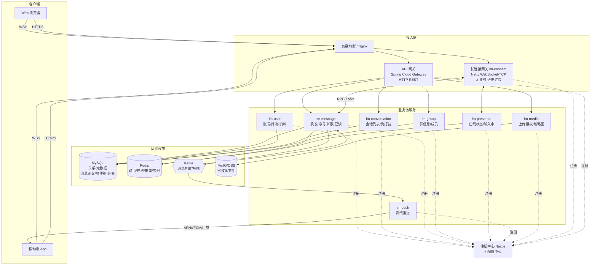

# 01 · 架构总览

## 1. 设计目标与约束

| 维度 | 决策 | 影响 |
|---|---|---|
| 技术栈 | Java + Spring Cloud 微服务，Netty 长连接网关 | 领域拆分、独立部署扩容 |
| 规模 | 十万 ~ 百万级在线用户 | 直接微服务化，分阶段落地 |
| 客户端 | Web（WebSocket）+ 移动端 App | 需离线推送（APNs/FCM/厂商通道） |
| 消息功能 | 文本/图片/文件/语音、已读回执、在线/输入中状态 | 富媒体存储、状态服务 |
| 群扩散 | 读写混合：小群（≤500）写扩散，大群（>500）读扩散 | 兼顾体验与成本 |
| 多端同步 | 多端漫游：云端永久存储 + 全量/增量同步 | 双层序号机制 |
| 中间件 | MySQL + Redis + Kafka + MinIO/OSS | 纯 MySQL 落地（消息表分库分表） |

## 2. 整体架构图

## 3. 分层设计

### 3.1 接入层 —— 双通道分离

接入层刻意拆成两条**互相独立**的通道：

- **`im-connect`（长连接通道）**
  - 基于 Netty，承载 WSS 长连接：心跳保活、协议编解码、连接↔用户映射。
  - **不含业务逻辑**，是"哑管道"。连接路由（`userId → gatewayId`）写入 Redis。
  - 可独立水平扩容；单实例宕机仅影响该批连接，客户端重连即漂移到其它实例。

- **`api-gateway`（请求-响应通道）**
  - 基于 Spring Cloud Gateway，承载 HTTP REST：登录、拉历史、拉会话列表、上传授权等。
  - 负责统一鉴权、限流、路由。

> **为什么分离**：长连接是有状态、长生命周期、海量并发的；HTTP 是无状态、短周期的。两者扩容曲线、故障模式、资源画像完全不同，分开才能各自独立优化与伸缩。

### 3.2 业务微服务层

按领域驱动拆分，全部无状态，经 Nacos 注册发现，服务间用 OpenFeign / gRPC 调用。详见 [02-微服务划分](02-services.md)。

### 3.3 基础设施层

| 组件 | 用途 |
|---|---|
| MySQL | 用户、好友、群、群成员、会话元数据；**消息正文（按会话分表）、用户收件箱（按用户分表）** |
| Redis | 连接路由、在线状态、序号生成、未读计数、输入中 |
| Kafka | 消息扩散、推送解耦、异步削峰 |
| MinIO/OSS | 图片、文件、语音等富媒体 |

## 4. 核心设计原则

1. **连接与业务分离** — 接入层只搬运字节，业务全在下游服务，互不拖累。
2. **写后异步扩散** — 发送链路只做"持久化 + 回 ACK"，扩散与推送经 Kafka 异步，发送 RT 低、可削峰。
3. **消息可靠性三段保证** — 客户端 `clientMsgId` 幂等 → 服务端落库后才回 ACK → 接收端漏收靠 seq 增量补偿。做到**不丢、不重、有序**。
4. **双层序号** — `user_seq`（用户级，多端漫游锚点）+ `conv_seq`（会话级，保证有序去重），职责分离。
5. **扩散模型可切换** — 用 `group.type` 一个字段在写扩散/读扩散间切换，小群快、大群省。

## 5. 关键链路一览

| 链路 | 路径 |
|---|---|
| 单聊发送 | client → im-connect → im-message（落库+ACK）→ Kafka → 扩散消费者 → 路由投递/离线推送 |
| 群聊发送 | client → im-message → 按群类型走写扩散或读扩散 |
| 多端漫游 | 设备上线上报 `since_seq` → im-message 返回 `> since_seq` 增量 |
| 在线状态 | im-connect 上下线事件 → im-presence 更新 Redis → 订阅方推送 |

详细时序见 [04-消息流程](04-message-flow.md)。
