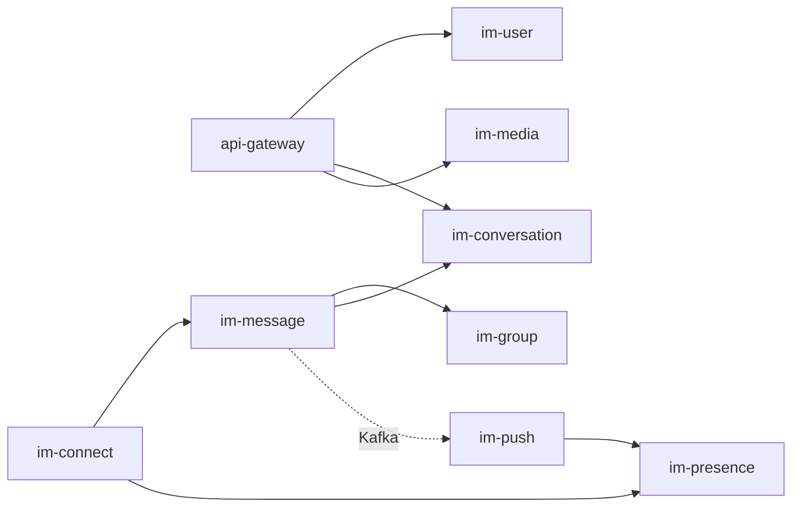

# 02 · 微服务划分

## 1. 服务总览

| 服务 | 职责 | 主要存储 | 对外接口 |
|---|---|---|---|
| **im-connect** | Netty 长连接、心跳、连接路由注册、上下行投递 | Redis（路由表） | WSS |
| **api-gateway** | HTTP 路由、统一鉴权、限流熔断 | — | HTTP |
| **im-user** | 注册登录、Token、好友关系、黑名单、用户资料 | MySQL | HTTP/RPC |
| **im-group** | 建群、群资料、成员增删、群类型、禁言 | MySQL | RPC |
| **im-conversation** | 会话列表、置顶、免打扰、未读汇总、会话同步点 | MySQL + Redis | HTTP/RPC |
| **im-message** | 消息收发、幂等、seq 生成、持久化、读写扩散、已读、撤回 | MySQL(分表) + Redis + Kafka | RPC/Kafka |
| **im-presence** | 在线/离线/输入中状态、状态订阅 | Redis | RPC |
| **im-push** | 离线消息聚合、对接 APNs/FCM/厂商通道、角标 | Redis + 第三方 | Kafka |
| **im-media** | 上传授权（预签名 URL）、缩略图、语音转码 | OSS/MinIO | HTTP |

## 2. 服务依赖关系

## 3. 各服务详解

### 3.1 im-connect（长连接网关）

- **核心职责**：维护海量 WSS 长连接，做协议编解码与上下行转发。
- **连接路由**：用户上线时写 `route:{userId} -> {gatewayId, channelId}`（Redis，支持多端 → Set）。下游服务据此找到用户所在网关实例投递。
- **无状态业务**：不解析业务语义，仅按协议帧转发给 `im-message` / `im-presence`。
- **下行投递**：扩散消费者通过路由查到目标网关 → RPC/内部 Kafka topic 推给对应 `im-connect` → 写回 channel。
- **扩容**：纯连接型，按连接数水平扩；故障域隔离。

### 3.2 im-user（用户服务）

- 账号体系：注册、登录、Token 签发与校验。
- 关系链：好友申请/通过/删除、黑名单。`friend` 双向各存一行便于查询。
- 资料：昵称、头像、签名等。

### 3.3 im-group（群组服务）

- 群生命周期：建群、解散、转让。
- 成员管理：邀请/踢人/退群、角色（owner/admin/member）、禁言。
- **群类型 `type`**：`small`（≤500，写扩散）/ `large`（>500，读扩散）。这是扩散路径选择的依据，阈值可配置。

### 3.4 im-conversation（会话服务）

- 会话列表：每个用户的会话索引（单聊/群聊），含最后一条消息、未读数、更新时间。
- 会话设置：置顶、免打扰。
- **会话同步点**：`last_read_seq`（已读位点）用于已读回执和大群读扩散的拉取起点。

### 3.5 im-message（消息核心服务）⭐

项目同名核心服务，承担最重的逻辑：

- **幂等**：基于 `clientMsgId` 去重，防止重发产生重复消息。
- **序号生成**：`conv_seq`（会话内）+ `user_seq`（用户级），均由 Redis INCR。
- **持久化**：消息正文写 MySQL（message 分表，落库后才回 ACK）。
- **扩散**：发 Kafka 事件，由消费者按扩散模型写 inbox / 推送。
- **已读回执**：接收方上报 → 更新 → 反向通知发送方。
- **撤回**：标记 `recall`，下发撤回指令。

### 3.6 im-presence（在线状态服务）

- 在线/离线：`im-connect` 上下线事件驱动，写 `presence:{userId}`。
- 输入中：`typing:{convId}` 短 TTL，实时下发对端。
- 状态订阅：好友/会话成员订阅彼此在线变化。

### 3.7 im-push（推送服务）

- 消费 Kafka 中"接收方离线"的事件，聚合后调第三方推送。
- 多通道：iOS APNs、Android FCM 及国内厂商通道（华为/小米/OPPO/vivo）。
- 角标未读数维护。

### 3.8 im-media（媒体服务）

- 上传授权：签发对象存储预签名 URL，客户端直传，不经业务服务。
- 处理：图片缩略图、语音转码。
- 消息中只存 `media_url` 引用。

## 4. 服务间通信方式

| 场景 | 方式 |
|---|---|
| 同步查询（查群成员、查用户资料） | OpenFeign / gRPC |
| 异步解耦（消息扩散、离线推送） | Kafka |
| 下行实时投递（推消息给在线用户） | 路由查 Redis → RPC/内部 Kafka topic → im-connect |
| 服务发现/配置 | Nacos |
