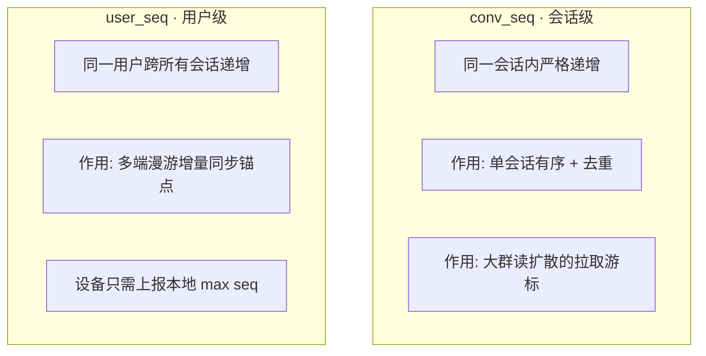

# 03 · 数据模型

数据分两层存储，按访问特征拆分：

- **MySQL** — 全部持久化数据：关系/元数据 + 消息正文 + 收件箱（消息相关表分库分表）
- **Redis** — 高频读写的路由、状态、序号、计数

> 本项目统一用 **MySQL** 落地存储，不引入 MongoDB。海量的 `message` / `inbox` 通过**分库分表（ShardingSphere）**水平扩展，详见第 5 节。

---

## 1. MySQL — 关系与元数据

### user — 用户

| 字段 | 类型 | 说明 |
|---|---|---|
| id | bigint PK | 用户 ID（雪花/号段） |
| username | varchar | 登录名（唯一） |
| nickname | varchar | 昵称 |
| avatar | varchar | 头像 URL |
| phone | varchar | 手机号 |
| status | tinyint | 正常/禁用 |
| created_at | datetime | 创建时间 |

### friend — 好友关系（双向各一行）

| 字段 | 类型 | 说明 |
|---|---|---|
| user_id | bigint | 所属用户 |
| friend_id | bigint | 好友 |
| remark | varchar | 备注名 |
| status | tinyint | 待通过/正常/拉黑 |
| created_at | datetime | |

> 索引：`(user_id, friend_id)` 唯一。

### group_info — 群

| 字段 | 类型 | 说明 |
|---|---|---|
| id | bigint PK | 群 ID |
| name | varchar | 群名 |
| avatar | varchar | 群头像 |
| owner_id | bigint | 群主 |
| type | varchar | `small`(≤500,写扩散) / `large`(>500,读扩散) |
| member_count | int | 成员数 |
| created_at | datetime | |

### group_member — 群成员

| 字段 | 类型 | 说明 |
|---|---|---|
| group_id | bigint | 群 |
| user_id | bigint | 成员 |
| role | tinyint | owner/admin/member |
| mute_until | datetime | 禁言到期 |
| joined_at | datetime | |

> 索引：`(group_id, user_id)` 联合唯一；`(user_id)` 查"我加入的群"。

### conversation — 会话（每用户视角）

| 字段 | 类型 | 说明 |
|---|---|---|
| id | bigint PK | 会话 ID |
| owner_id | bigint | 会话所属用户 |
| peer_type | varchar | `single` / `group` |
| peer_id | bigint | 对端用户 ID 或群 ID |
| last_msg_id | bigint | 最后一条消息 |
| last_read_seq | bigint | 已读位点（已读回执/读扩散拉取起点） |
| unread | int | 未读数 |
| is_pinned | tinyint | 置顶 |
| is_muted | tinyint | 免打扰 |
| updated_at | datetime | 排序依据 |

> 索引：`(owner_id, updated_at)` 拉会话列表。

---

## 2. MySQL — 消息正文（分表）

### message — 消息正文（按 `conversation_id` 分库分表）

一条消息存一份。分片键 `conversation_id`，保证同一会话落同一分片、可按 `seq` 顺序扫描。

| 字段 | 类型 | 说明 |
|---|---|---|
| id | bigint PK | 自增/雪花主键 |
| conversation_id | bigint | **分片键** |
| msg_id | bigint | 全局消息 ID（雪花） |
| seq | bigint | conv_seq：会话内递增，保证有序去重 |
| sender_id | bigint | 发送者 |
| type | tinyint | text/image/file/voice |
| content | varchar/json | 文本内容或结构化体 |
| media_url | varchar | 富媒体引用（指向 OSS） |
| status | tinyint | normal/recalled |
| created_at | datetime | |

> 索引：`UNIQUE(conversation_id, seq)`。
> 读扩散拉群消息 = `SELECT * FROM message WHERE conversation_id=? AND seq>? ORDER BY seq LIMIT n`（命中分片键 + 索引，单分片查询）。
> 撤回 = 按 `(conversation_id, msg_id)` 更新 `status/recall`。

### inbox — 用户收件箱（写扩散用，按 `user_id` 分库分表）

单聊 + 小群消息写入每个成员的 inbox；大群不写 inbox（走读扩散）。

| 字段 | 类型 | 说明 |
|---|---|---|
| id | bigint PK | 自增/雪花主键 |
| user_id | bigint | **分片键** |
| user_seq | bigint | 用户级递增 → 多端漫游核心锚点 |
| conversation_id | bigint | 所属会话 |
| msg_id | bigint | 指向 message 正文 |
| created_at | datetime | |

> 索引：`UNIQUE(user_id, user_seq)`。
> 多端同步 = `SELECT * FROM inbox WHERE user_id=? AND user_seq>? ORDER BY user_seq LIMIT n`（命中分片键 + 索引，单分片查询）。

> **说明**：inbox 只存「消息索引」（msg_id 引用），不存正文。同步时先拉 inbox 拿到 msg_id 列表，再按需回查 message 正文（或客户端本地已有则免查）。避免正文在每个成员处冗余存储，控制写放大体积。

---

## 3. Redis（热数据）

| Key | 类型 | 用途 |
|---|---|---|
| `route:{userId}` | Set | 连接路由 `{gatewayId+channelId}`，支持多端 |
| `presence:{userId}` | Hash | 在线状态 + lastActive |
| `seq:user:{userId}` | String(INCR) | 用户级序号（多端漫游锚点） |
| `seq:conv:{convId}` | String(INCR) | 会话内序号 |
| `unread:{userId}:{convId}` | String(INCR) | 未读计数 |
| `typing:{convId}` | String(TTL) | 输入中状态（秒级过期） |
| `idemp:{clientMsgId}` | String(TTL) | 发送幂等去重 |

---

## 4. 序号机制（双层）⭐

IM 的核心难点是消息**有序、不丢、不重、多端一致**，靠两个序号解决：



- **`conv_seq`**：保证单个会话消息顺序，客户端据此排序、去重、检测空洞。
- **`user_seq`**：用户维度的全局递增号。任意设备上线只上报本地最大 `user_seq`，服务端返回 `> since_seq` 的增量，即实现多端漫游。

> 生成方式：Redis `INCR`（性能足够）。如需更强持久化可换号段模式（DB 分配号段 + 本地内存递增）。

---

## 5. 分库分表设计（ShardingSphere）

纯 MySQL 方案下，消息相关表通过 **Apache ShardingSphere** 分库分表水平扩展；关系/元数据表量级可控，初期单库即可。

| 表 | 分片键 | 策略 | 说明 |
|---|---|---|---|
| message | conversation_id | 哈希分片 | 同会话同分片，按 seq 顺序扫 |
| inbox | user_id | 哈希分片 | 同用户同分片，按 user_seq 增量同步 |
| conversation | owner_id | 按用户分片（可选） | 量大时再分 |
| group_member | group_id | 按群分片（可选） | 大群成员多时再分 |
| user / friend / group_info | — | 暂不分片 | 量级可控，单库承载 |

**分片要点**

- **分片数预留**：初期可设较多逻辑分片（如 1024），物理库少（如 4 库），后续加库只需迁移分片、不改分片键。
- **查询都带分片键**：拉历史带 `conversation_id`、多端同步带 `user_id`，均命中单分片，无跨分片聚合。
- **跨分片场景规避**：不做"全局按时间排序所有消息"这类需求；列表排序靠 `conversation.updated_at`，消息排序靠会话内 `seq`。

### 冷热分离（可选优化）

消息只增不减，长期数据量大。可按时间冷热分离，进一步减轻在线库压力：

```
热数据(近 N 个月)  → MySQL 在线分片库，低延迟读写
冷数据(历史归档)  → 归档库 / 对象存储(OSS) + 索引，成本低、按需回捞
```

> 中等规模（十万~百万级）初期，单纯 MySQL 分库分表已足够；冷热分离待数据量增长后再引入。
