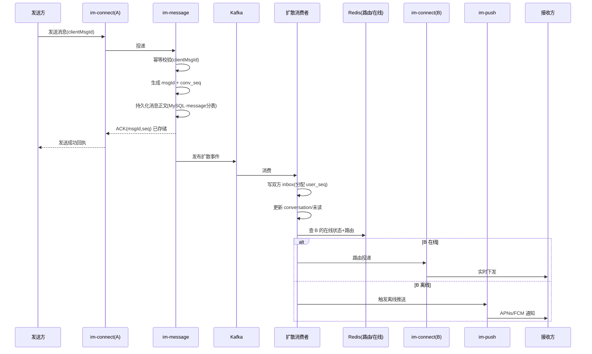
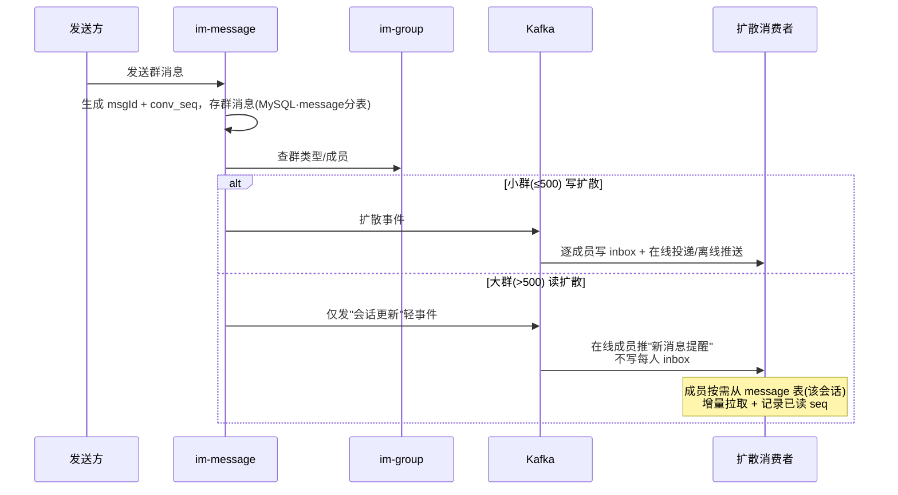
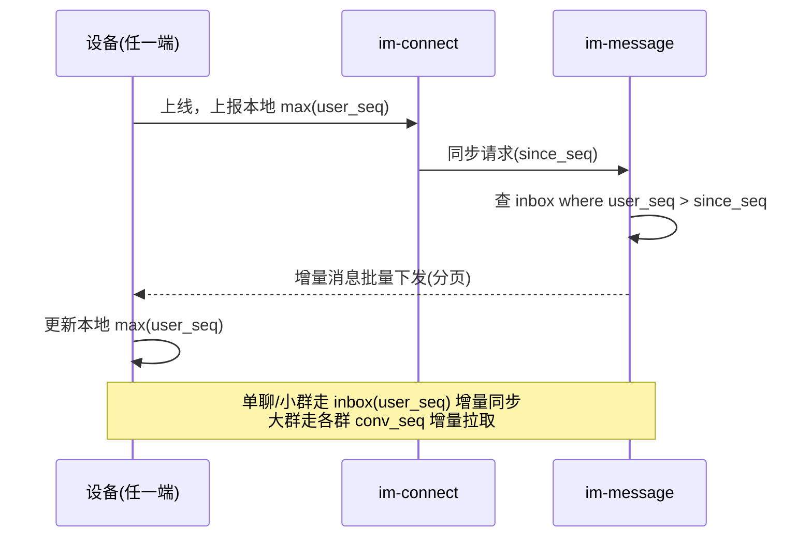
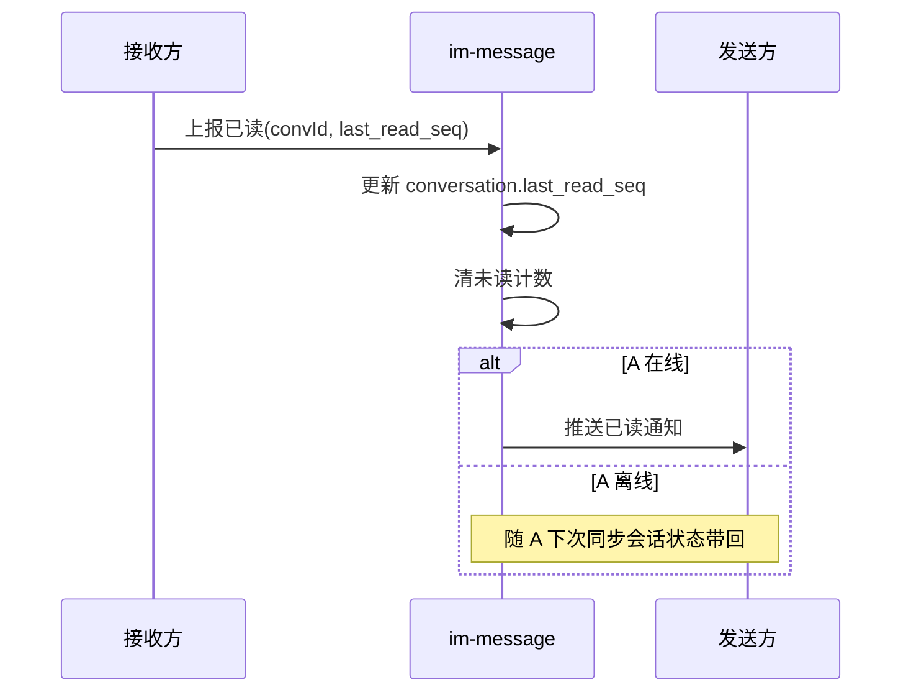
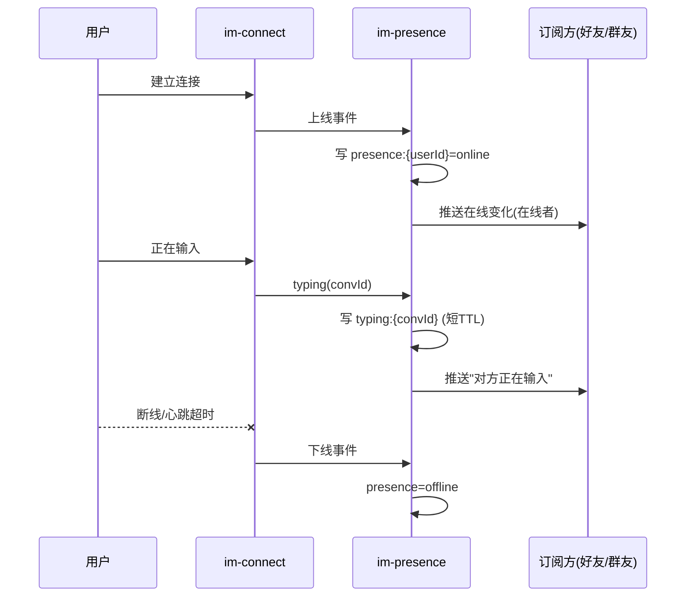

# 04 · 消息流程与时序

## 1. 单聊发送（写扩散 + 在线/离线分流）

**要点**

- 服务端**落库后才回 ACK**，保证"发送成功"语义可靠。
- 扩散与推送全在 ACK 之后异步进行，发送 RT 不受影响。
- 接收方在线则实时投递；离线则转推送，待其上线再走增量同步补齐。

---

## 2. 群聊发送（读写混合扩散）

### 扩散模型取舍

| | 写扩散（小群） | 读扩散（大群） |
|---|---|---|
| 消息存储 | message 表 + 每人 inbox 各一份 | 仅 message 表一份 |
| 读取 | inbox 直接读，快 | 按 conv_seq 拉 message 表 |
| 写放大 | N 倍（N=成员数） | 无 |
| 适用 | ≤500 人，体验优先 | >500 人，成本优先 |
| 多端漫游 | 天然按 user_seq 同步 | 按群 conv_seq + last_read_seq 同步 |

> 阈值默认 500，可配置；由 `group_info.type` 标记，`im-message` 据此选择路径。
> 小群迁移成大群时可异步转换扩散方式。

---

## 3. 多端漫游 / 增量同步

- 设备只需记住本地最大 `user_seq`，上线一次性补齐离线期间所有单聊/小群消息。
- 大群消息不在 inbox，单独按各群 `conv_seq` 与 `last_read_seq` 拉取。
- 同一账号多设备各自维护本地 seq，互不干扰，最终一致。

---

## 4. 已读回执

- 接收方阅读后上报 `last_read_seq`，更新会话已读位点并清未读。
- 反向通知发送方（在线即时推、离线随下次同步），驱动发送方 UI 的"已读"标记。

---

## 5. 在线状态与输入中

---

## 6. 消息可靠性保证

| 问题 | 机制 |
|---|---|
| **不丢** | 落库后才回 ACK；接收端 ACK + 漏收靠 seq 增量补偿 |
| **不重** | 发送侧 `clientMsgId` 幂等；接收侧按 `conv_seq` 去重 |
| **有序** | `conv_seq` 单会话严格递增；客户端按 seq 排序、检测空洞补拉 |
| **多端一致** | `user_seq` 增量同步，任意设备最终收敛到同一状态 |
| **离线可达** | 离线转推送；上线增量同步补齐 |
