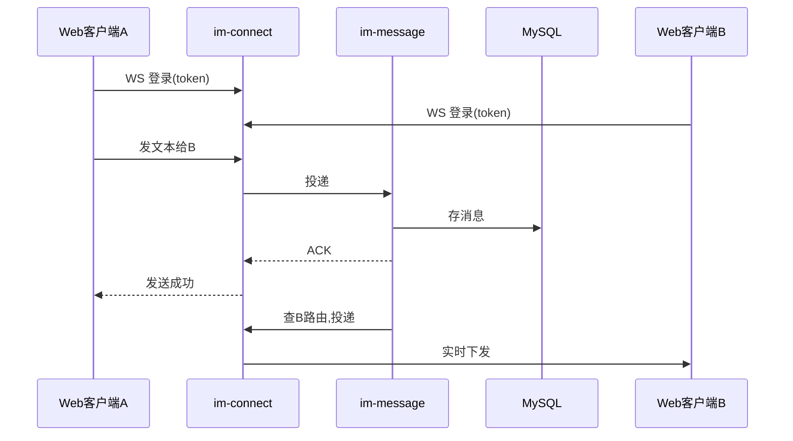
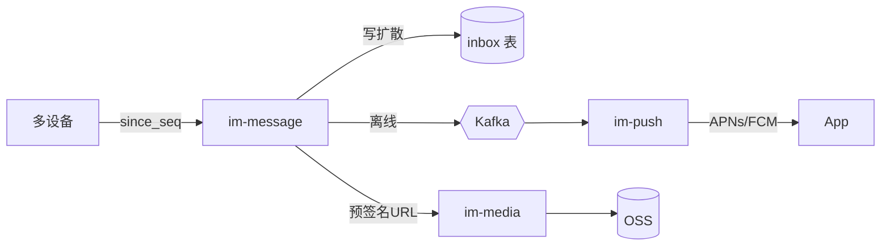
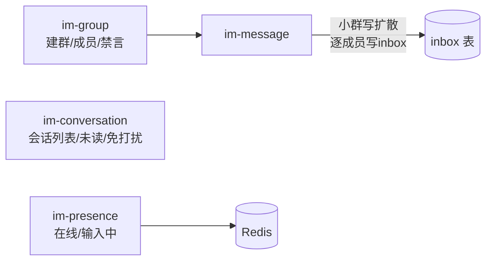
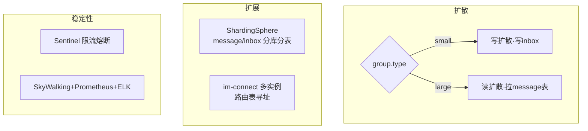

# 05 · 落地路线与技术选型

## 1. 分阶段落地


| 阶段 | 目标 | 范围 | 验收标准 |
|---|---|---|---|
| **P0 骨架** | 跑通最小闭环 | im-connect(Netty WS) + im-user(登录) + im-message(单聊文本：存储+在线投递) | 两个 Web 客户端登录后互发文本，实时收到 |
| **P1 核心** | 单聊完整 | 离线消息 + 推送(im-push)、富媒体(im-media)、已读回执、多端漫游(user_seq) | 离线消息可达；多设备登录看到完整历史；图片/语音可发 |
| **P2 群聊** | 群基础能力 | im-group + im-conversation + 小群写扩散；在线状态(im-presence) | 建群、群内收发、已读、在线/输入中状态 |
| **P3 规模化** | 大群与扩容 | 大群读扩散、分库分表、网关多实例路由、限流熔断、可观测 | 万人大群可用；网关水平扩容；全链路监控 |

## 2. P0 详细范围（首个里程碑）

最小可运行闭环，验证核心架构假设：



P0 暂不含：群聊、离线推送、富媒体、读扩散、分库分表。先打通"连接→收发→存储→投递"主干。

**关键任务**

- [ ] `im-connect`：Netty WebSocket 服务、握手鉴权、心跳、连接↔用户映射写 Redis（`route:{userId}`）
- [ ] `im-user`：登录接口、Token 签发与校验
- [ ] `im-message`：单聊文本收发、`conv_seq` 生成（Redis INCR）、`message` 表落库、按路由下行投递
- [ ] 协议：定义最小消息帧（登录 / 发消息 / ACK / 下推）
- [ ] 简单 Web 客户端用于联调

**验收标准**：两个 Web 客户端登录后互发文本，发送方收到 ACK、接收方实时收到。

---

## 3. P1 详细范围（单聊完整）

让单聊达到生产可用：离线可达、多端一致、支持富媒体与已读。



**涉及服务**：`im-message`(增强) + 新增 `im-push`、`im-media`

**关键任务**

- [ ] **写扩散落地**：消息写入收发双方 `inbox`，分配 `user_seq`（用户级 Redis INCR）
- [ ] **多端漫游**：增量同步接口 `sync(since_seq)`；客户端上线上报本地 max `user_seq` 拉增量
- [ ] **离线消息 + 推送**：接收方离线 → Kafka 事件 → `im-push` → APNs/FCM/厂商通道；角标未读数
- [ ] **富媒体**：`im-media` 签发对象存储预签名 URL（客户端直传）、图片缩略图、语音转码；消息存 `media_url`
- [ ] **已读回执**：接收方上报 `last_read_seq` → 更新会话 → 反向通知发送方
- [ ] **可靠性**：`clientMsgId` 幂等、漏收按 seq 空洞补拉

**验收标准**：离线消息上线后可补齐；同账号多设备看到一致完整历史；图片/语音可收发；发送方能看到"已读"标记。

**不包含**：群聊、大群读扩散、分库分表规模化。

---

## 4. P2 详细范围（群聊基础能力）

补齐群聊主线，先用写扩散覆盖小群（≤500）。



**涉及服务**：新增 `im-group`、`im-conversation`、`im-presence`；`im-message` 增加群扩散

**关键任务**

- [ ] **群管理**：建群 / 解散 / 转让、成员邀请-踢出-退群、角色（owner/admin/member）、禁言；`group_info`、`group_member`
- [ ] **小群写扩散**：群消息逐成员写 `inbox`（复用 P1 写扩散路径），群类型固定 `small`
- [ ] **会话服务**：会话列表、未读汇总、置顶、免打扰；`conversation` 表 + 列表拉取接口
- [ ] **在线状态**：`im-presence` 消费 `im-connect` 上下线事件写 `presence:{userId}`；输入中 `typing:{convId}`（短 TTL）；好友/群友订阅推送
- [ ] **群已读**：成员上报已读位点（小群可做简化版已读人数统计）

**验收标准**：可建群、邀请/退群；群内实时收发并多端同步；会话列表正确排序与未读计数；在线/输入中状态实时可见。

**不包含**：大群（>500）读扩散、分库分表、限流熔断与可观测体系。

---

## 5. P3 详细范围（规模化与大群）

支撑万人大群与水平扩容，补齐生产稳定性。



**涉及服务**：全量服务的规模化改造（重点 `im-message`、`im-connect`）

**关键任务**

- [ ] **大群读扩散**：`group.type=large` 时不写 inbox，仅存 `message` 表 + 发"会话更新"轻事件；成员按 `conv_seq` 增量拉取、已读位点记 `conversation.last_read_seq`
- [ ] **扩散切换**：按 `group.type` 自动选写/读扩散；小群超阈值（默认 500）转大群的迁移流程
- [ ] **分库分表**：接入 ShardingSphere，`message`(分片键 conversation_id) / `inbox`(分片键 user_id)；逻辑分片预留、扩容迁移方案
- [ ] **网关扩容**：`im-connect` 多实例化，下行投递按 Redis 路由表寻址目标实例；客户端重连漂移
- [ ] **限流熔断**：Sentinel 保护下游（发送限频、热点群限流）
- [ ] **可观测**：SkyWalking 全链路追踪、Prometheus + Grafana 指标看板、ELK 日志
- [ ] **冷热分离（可选）**：历史消息归档库/OSS，减轻在线分片库压力
- [ ] **压测**：连接数、消息吞吐、大群扩散延迟达标

**验收标准**：万人大群正常收发与拉取；`im-connect` 水平扩容无单点；分库分表后查询仍命中单分片；全链路 trace 与监控告警可用；压测达到目标容量。

---

## 6. 技术选型清单

| 类别 | 选型 | 说明 |
|---|---|---|
| 微服务框架 | Spring Boot 3 + Spring Cloud 2023 | 主流 LTS 组合 |
| 注册/配置中心 | Nacos | 服务发现 + 动态配置 |
| API 网关 | Spring Cloud Gateway | HTTP 路由、鉴权、限流 |
| 限流熔断 | Sentinel | 保护下游 |
| 服务调用 | OpenFeign / gRPC | 同步内调 |
| 长连接 | Netty | WebSocket over TLS，自定义/Protobuf 协议 |
| 存储 | MySQL 8 | 关系/元数据 + 消息表分库分表（ShardingSphere） |
| 缓存/状态 | Redis Cluster | 路由、在线、序号、计数 |
| 消息队列 | Kafka | 扩散/推送解耦、削峰 |
| 对象存储 | MinIO / 云 OSS | 富媒体 |
| 离线推送 | APNs / FCM / 厂商通道 | iOS/Android |
| 链路追踪 | SkyWalking | 分布式 trace |
| 监控告警 | Prometheus + Grafana | 指标 |
| 日志 | ELK | 集中日志 |

## 7. 工程结构建议（Maven 多模块）

```
ms-im-message/
├── im-common/         # 通用工具、协议定义、DTO、常量
├── im-connect/        # Netty 长连接网关
├── im-gateway/        # Spring Cloud Gateway
├── im-user/           # 用户服务
├── im-group/          # 群组服务
├── im-conversation/   # 会话服务
├── im-message/        # 消息核心服务
├── im-presence/       # 在线状态服务
├── im-push/           # 推送服务
├── im-media/          # 媒体服务
└── docs/              # 设计文档（本目录）
```

## 8. 待后续细化的开放问题

随落地推进需补充设计的点：

- **协议设计**：长连接帧格式（消息类型、版本、压缩、加密）。
- **鉴权方案**：Token 在长连接与 HTTP 两通道的统一校验。
- **大群转换**：小群超过阈值时写扩散→读扩散的迁移流程。
- **消息撤回/删除**：撤回时限、多端撤回一致性。
- **安全合规**：消息审核、敏感词、端到端加密（如需）。
- **容灾**：多机房、MySQL/Kafka/Redis 高可用部署拓扑。
