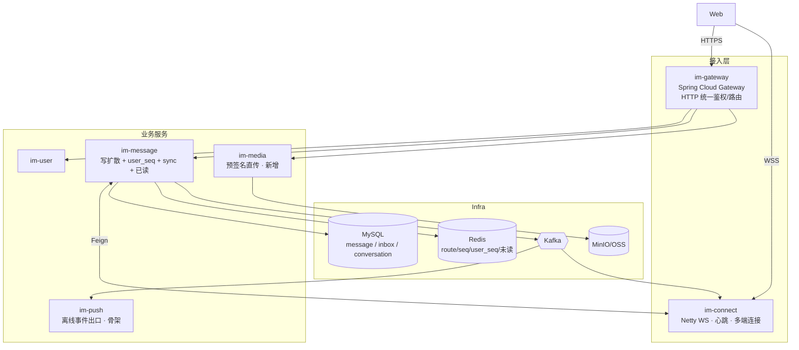
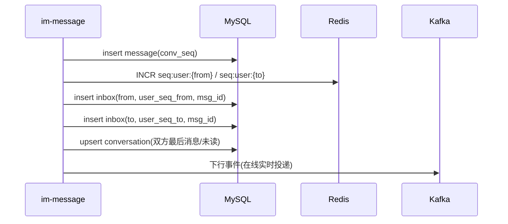

# 06 · P1 阶段设计与计划（单聊完整）

> 本文是 [05-落地路线](05-roadmap.md) 中 **P1（单聊完整）** 的可执行设计与排期。
> 上层战略路线以 05 为准；本文负责把 P1 拆成「能直接开工」的设计决策、数据模型、接口契约与任务清单。

---

## 0. P0 收尾盘点

### 0.1 P0 实际已完成

| 模块 | 能力 | 关键实现 |
|---|---|---|
| im-user | 登录（JWT HS256）、批量用户公开信息 | `AuthController`、`UserController` |
| im-message | 单聊发送（落库 + 回 ACK + Kafka 下行） | `MessageService.send`；`clientMsgId` 幂等（`idemp:{id}`）、`conv_seq`（`seq:conv:{cid}` INCR）、雪花 `msgId` |
| im-message | 会话列表、历史拉取、未读 | `conversation` 表 + `ConversationService`（联调期补，原属 P1/P2，已提前落地）|
| im-connect | Netty WS 网关、WS 内登录鉴权、单连接登录 | `NettyWebSocketServer`、`WebSocketFrameHandler`、`ChannelManager` |
| im-connect | 连接路由表、Kafka 下行投递 | `RouteRegistry`（`route:{userId}`）、`DownlinkConsumer`（每网关独立消费组=广播） |
| 基础设施 | MySQL / Redis / Kafka / Nacos | 单节点 `8.153.38.116` |

**验收达成**：两个网页端登录后互发文本、发送方收 ACK、接收方实时收到，且登录后能拉会话列表与历史。

### 0.2 P0 遗留技术债（P1 必须处理 / 显式记录）

| # | 问题 | 影响 | P1 处理 |
|---|---|---|---|
| D1 | HTTP 读接口（`/conversations`、`/messages/history`、`/users`）只凭 `userId` 入参、**不校验 JWT** | 任何人传 userId 即可读他人数据 | **P1.0 引入 `im-gateway` 统一鉴权**，下游从网关注入的身份取 userId，不再信任入参 |
| D2 | DB 账号/密码、JWT secret 明文写在 `application.yml` | 凭据泄露、不可轮换 | 下沉 Nacos 配置中心 + 环境变量（见 §9） |
| D3 | Kafka 下行**广播**：每网关消费每条消息 | 单实例可用；多实例会放大 N 倍无效投递 | P1 单实例阶段保留；多实例寻址投递列入 P3（路由表已就绪） |
| D4 | `conversation` 表**仅对改动后消息生效**，无存量回填 | 改动前历史不进会话列表 | P1 写扩散落地时一并补回填脚本 |
| D5 | WS 管线**无心跳 / IdleStateHandler** | 死连接不能及时回收，`route` 残留 | P1.0 加 `IdleStateHandler` + 心跳帧 + 超时关闭 |
| D6 | 每用户**单连接**（重复登录被拒） | 不支持多端 | P1 多端漫游放开，按 deviceId 多连接 |
| D7 | 接收方离线消息直接丢弃（`DownlinkConsumer` 注释「留待 P1」） | 离线不可达 | P1 写扩散 + 重连增量同步 |

---

## 1. P1 目标与范围

**目标**：让单聊达到生产可用 —— 离线可达、多端一致、支持富媒体与已读回执。

### 1.1 Web-first 取舍（重要）

现阶段只有网页端。对「离线推送」做如下务实切分：

- **网页端的「离线」= 服务端持久化 + 重连增量补拉**（靠 `user_seq` + `inbox` + `sync` 接口实现），**P1 必做**。
- **移动端 APNs/FCM/厂商推送**：无移动端，**显式延后**到移动端接入时再做，`im-push` 本期只预留 Kafka 事件出口与接口骨架，不接真实通道。

### 1.2 范围

**In scope**
- 双层序号：在 `conv_seq` 之上引入 `user_seq`（用户级漫游锚点）
- 写扩散：消息写收发双方 `inbox`
- 多端漫游：`sync(since_seq)` 增量同步；放开多设备登录
- 已读回执：`last_read_seq` 上报 → 更新会话 → 反向通知发送方
- 富媒体：`im-media` 预签名直传，消息存 `media_url`（图片优先）
- 统一鉴权：`im-gateway` + 长连接通道身份统一
- 可靠性：seq 空洞补拉、心跳保活

**Out of scope（留 P2/P3）**
- 群聊、读扩散、分库分表、Sentinel 限流、全链路可观测、移动端真实推送通道

---

## 2. 架构增量



**本期服务变化**：新增 `im-gateway`、`im-media`、`im-push`(骨架)；`im-message`、`im-connect` 增强。

---

## 3. 关键设计

### 3.1 双层序号（conv_seq + user_seq）

| 序号 | 粒度 | 来源 | 职责 |
|---|---|---|---|
| `conv_seq` | 会话级（已实现） | `INCR seq:conv:{cid}` | 会话内严格有序、去重 |
| `user_seq` | 用户级（**P1 新增**） | `INCR seq:user:{userId}` | 多端漫游锚点：客户端按 `since_seq` 拉增量 |

一条单聊消息：会话内分配 1 个 `conv_seq`；写入收发双方 `inbox` 时，各自分配本人的 `user_seq`。

### 3.2 写扩散与 inbox 表

发送链路在「落 `message`」之后，向**收发双方各写一行 `inbox`**（每行带该用户的 `user_seq`）。`message` 存正文唯一副本，`inbox` 存「谁的第几条收到了哪条消息」的索引。



> `conversation`（会话摘要：最后一条 + 未读，P0 已建）与 `inbox`（按用户的消息流，P1 新建）职责不同，二者并存。

### 3.3 多端漫游 sync(since_seq)

- 设备上线（WS 登录成功后）或 HTTP 拉取时，上报本地最大 `user_seq`。
- `GET /sync?sinceSeq=&limit=` 返回 `inbox` 中 `user_seq > sinceSeq` 的消息（升序），客户端据此补齐。
- 多端：放开 `ChannelManager` 单连接限制，`userId -> Set<Channel>`（按 `deviceId` 区分），下行投递给该用户的全部在线连接。

### 3.4 离线消息（网页端口径）

接收方不在线时，`DownlinkConsumer` 不再直接丢弃：消息已落 `inbox`，**重连后通过 `sync` 增量补齐**。`im-push` 仅向 Kafka 发「离线待推」事件占位，本期不接真实推送通道。

### 3.5 已读回执（last_read_seq）

- 接收方进入会话上报已读位点：`POST /conversations/read`（现有清未读接口扩展为写 `last_read_seq`）。
- `conversation` 增列 `last_read_seq`；服务端据此算未读，并通过 Kafka/WS **反向通知发送方**「已读到 seq=X」。

### 3.6 富媒体（预签名直传）

- `im-media` 签发对象存储（MinIO/OSS）预签名 URL，客户端**直传**，不经业务服务。
- 发送消息时 `type=2(image)`，正文带 `media_url`（+ 缩略图 URL）。`message`/`inbox` 已有 `media_url` 字段。

### 3.7 统一鉴权（修复 D1）

- **HTTP 通道**：`im-gateway` 全局过滤器校验 `Authorization: Bearer <jwt>`，解析出 `userId` 通过内部头（如 `X-User-Id`）下传；下游接口**删除 `userId` 入参**，改从该头取，杜绝越权。
- **长连接通道**：保留 WS `LOGIN{token}` 校验（已实现），并补 token 过期/续期策略。
- 两通道共用 `im-common/JwtUtil` 与同一 secret（下沉 Nacos）。

---

## 4. 数据模型变更

### 4.1 新增 `inbox` 表（im_message 库）

```sql
CREATE TABLE IF NOT EXISTS `inbox` (
    `id`              BIGINT      NOT NULL AUTO_INCREMENT,
    `owner_id`        BIGINT      NOT NULL COMMENT '收件箱所有者',
    `user_seq`        BIGINT      NOT NULL COMMENT '用户级递增序号(漫游锚点)',
    `conversation_id` VARCHAR(64) NOT NULL,
    `msg_id`          BIGINT      NOT NULL COMMENT '指向 message.msg_id',
    `conv_seq`        BIGINT      NOT NULL COMMENT '冗余会话内序号,便于排序',
    `created_at`      DATETIME    NOT NULL DEFAULT CURRENT_TIMESTAMP,
    PRIMARY KEY (`id`),
    UNIQUE KEY `uk_owner_userseq` (`owner_id`, `user_seq`),
    KEY `idx_owner_conv` (`owner_id`, `conversation_id`, `conv_seq`)
) ENGINE = InnoDB DEFAULT CHARSET = utf8mb4 COMMENT '用户收件箱(写扩散)';
-- 分片键预留：owner_id（P3 ShardingSphere）
```

### 4.2 `conversation` 增列

```sql
ALTER TABLE `conversation` ADD COLUMN `last_read_seq` BIGINT DEFAULT 0 COMMENT '已读到的 conv_seq';
```

### 4.3 Redis key 新增（补进 `RedisKeys`）

| key | 用途 |
|---|---|
| `seq:user:{userId}` | 用户级序号 INCR |
| `presence:{userId}`（P2） | 在线状态（本期暂不做，占位） |

`message` 表本期不变。

---

## 5. 接口变更 / 新增

| 接口 | 服务 | 说明 |
|---|---|---|
| 所有现有 HTTP 读接口 | gateway→下游 | **去掉 `userId` 入参**，改从网关注入的 `X-User-Id` 取（D1） |
| `GET /sync?sinceSeq=&limit=` | im-message | 多端漫游增量拉取（读 `inbox`） |
| `POST /conversations/read` | im-message | 扩展为写 `last_read_seq` + 触发已读回执 |
| `POST /media/presign` | im-media | 申请上传预签名 URL |
| WS 帧 `PING/PONG` | im-connect | 心跳保活 |
| WS 帧 `READ`（下行） | im-connect | 已读回执反向通知发送方 |
| Kafka `message_offline` | im-message→im-push | 离线待推事件（骨架） |

---

## 6. 任务拆解与里程碑

按 web-first、依赖优先排序，建议拆 3 个里程碑：

### P1.0 — 安全与连接基座（先做，解阻塞）
- [x] 新建 `im-gateway`（Spring Cloud Gateway）：JWT 全局过滤、`X-User-Id` 下传、路由 user/message/media（D1）
- [x] 下游读接口去 `userId` 入参，改取网关身份（`@RequestHeader("X-User-Id")`）
- [x] 凭据/secret 外置为环境变量占位（DB/JWT/Redis/Kafka/Nacos，见实现说明）（D2）
- [x] im-connect 加 `IdleStateHandler` + `PING/PONG` + 超时关闭（D5）

### P1.1 — 写扩散与多端漫游（核心）
- [x] `inbox` 表 + `user_seq`（`seq:user:{userId}` INCR）
- [x] `MessageService` 写扩散（同库事务 `MessagePersister` 双写 inbox）+ `BackfillRunner` 存量回填（D4）
- [x] `GET /sync` 增量同步接口（读 inbox）
- [x] `ChannelManager` 放开多连接（`userId -> deviceId -> Channel`），下行投递广播到该用户全部连接（D6）
- [x] 离线落 inbox + 重连补拉打通；全局离线发 `message_offline` 事件（D7）

### P1.2 — 已读与富媒体
- [x] `conversation.last_read_seq` + 已读上报 + 反向回执（Kafka `MESSAGE_READ` → WS `READ` 帧）
- [x] 新建 `im-media`：MinIO 预签名直传（`POST /media/presign`）；compose 增 MinIO
- [x] `im-push` 骨架：消费 `message_offline`，仅日志/占位（不接真实通道）


> **实现与设计的两处偏差（已编码）**：
> 1. **D2 凭据**：本期落地为「环境变量占位 + 现值兜底默认」（如 `${DB_PASSWORD:Admin_1234}`），**未接 Nacos 配置中心**（其 import 仍禁用）。Nacos config 留作生产目标。
> 2. **离线判定位置**：`message_offline` 事件由 **im-connect**（掌握在线状态）在「本地未投递且 `route` 为空」时发出，而非 im-message。单实例下精确；多实例广播下会重复发，去重随 D3 留 P3。
>
> **状态**：以上全部已编码且 `mvn compile` 全模块通过；**尚未做运行期联调验证**（§7 验收标准需起中间件后实测）。

---

## 7. 验收标准

1. **越权关闭**：不带合法 JWT 无法读任何用户数据；下游不再接受 `userId` 入参。
2. **离线可达**：接收方离线期间的消息，重连后经 `sync` 全部补齐，无丢、无重、有序。
3. **多端一致**：同账号两个网页端登录，历史与新消息一致；任一端发送，另一端实时可见。
4. **已读**：接收方读后，发送方看到「已读」标记。
5. **富媒体**：网页端可发图片并双端正常显示。
6. **保活**：断网/僵死连接在心跳超时后被回收，`route` 不残留。

---

## 8. 风险与开放问题

- **写扩散一致性**：message 落库与双写 inbox 的事务边界（建议同库本地事务；inbox 写失败的补偿/重放）。
- **回填脚本**：存量 message → inbox/conversation 的一次性回填需停写或幂等可重入。
- **多端 user_seq 语义**：user_seq 是「每用户一条流」，多端共享同一序列；客户端各自维护本地 max。
- **gateway 与 im-connect 鉴权统一**：token 续期、踢线、黑名单（登出即失效）策略需明确。
- **read 回执放大**：高频已读上报需合并/节流（按 seq 取最大，去抖）。

---

## 9. 安全与部署补强（贯穿项）

> 注：团队已有 k8s 环境（master `172.20.253.6` / worker `172.20.253.5`，containerd + kubeadm + Calico）。本期顺带把部署收口。

- **凭据治理**：DB 密码、JWT secret 移出 `application.yml` → Nacos 配置 + k8s Secret；CORS 由全放开收敛为网关白名单。
- **容器化**：各服务出 Dockerfile + 镜像；Nacos/MySQL/Redis/Kafka 以 StatefulSet 或外部托管接入。
- **k8s 编排**：Deployment（无状态业务）+ Service；`im-connect` 因长连接需 `Service(type=LoadBalancer/NodePort)` + 会话亲和或客户端重连漂移；就绪/存活探针。
- **可观测**：本期最小化（日志集中 + 基础指标），完整 SkyWalking/Prometheus/ELK 留 P3。

---

## 10. 附：与 05-roadmap 的对应

本文是 05 文档 §3（P1 详细范围）的落地细化，并据「web-first、无移动端」现状做了排序调整：把 APNs/FCM 真实推送通道延后、把统一鉴权（原 §8 开放问题）提前为 P1.0 前置。群聊/读扩散/分库分表仍按 05 路线在 P2/P3 进行。
